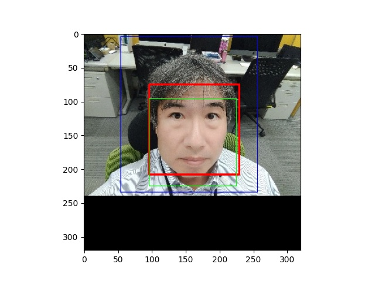
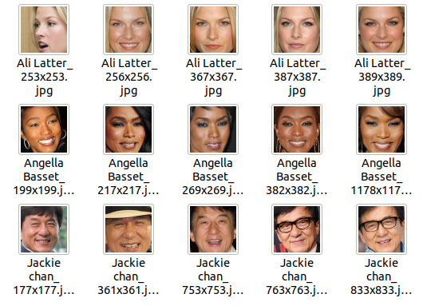
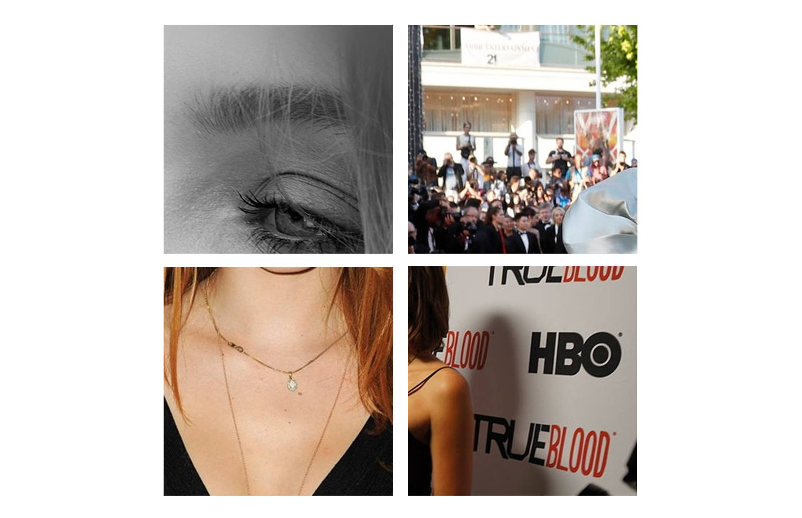
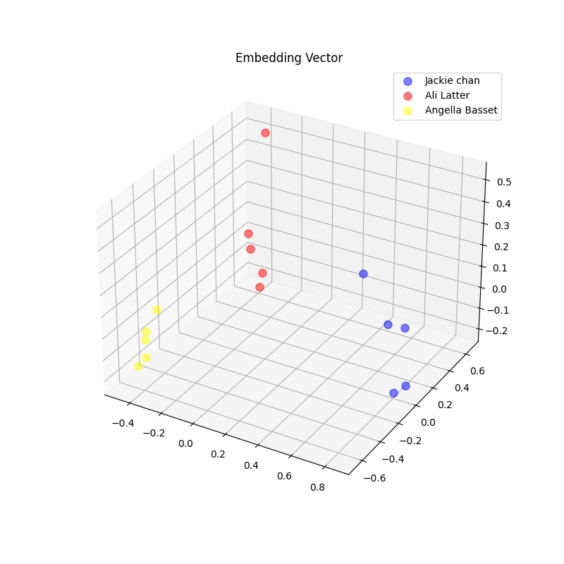

# Edge TPUで顔認証してみる～実装編その２

## １．今回やること

[前回の記事](https://www.soliton-cyber.com/blog/edgetpu2)では、顔認識モデルとして学習済みのFaceNetモデル：FaceNet by Hiroki Taniai[[1]](https://github.com/nyoki-mtl/keras-facenet)を使用することに決まりました。
今回は、PCにてFaceNetを実装して、顔エンコーディング（Face Encoding）の結果、正しい埋め込みベクトルが出力されることを確認します。

>参考文献：  
>[1] [GitHub nyoki-mtl/keras-facenet](https://github.com/nyoki-mtl/keras-facenet)  

## ２．顔検出（Step1）

### （１）OpenCV:Haar-like特徴分類器について

FaceNet by Hiroki Taniai[[1]](https://github.com/nyoki-mtl/keras-facenet)のデモプログラム（GitHubのnotebookディレクトリにてipynbファイルあり）によれば、顔検出に「OpenCV:Haar-like特徴分類器[[2]](http://opencv.jp/opencv-2svn/py/objdetect_cascade_classification.html)」が用いられています。FaceNetモデルの学習時入力画像の条件に合わせるため、我々もこのやり方にしたがうことにします。

モデルファイルはXML形式で、OpenCVのサイト[[3]](https://opencv.org/releases/)からダウンロードできます。

### （２）顔検出プログラム

手間はdlibの場合とほとんど変わりません。しかしこの方法では、一人しか写っていない画像にもかかわらず本命のバウンディングボックス（以下BOX）の他に誤検知と思われる小さなBOXも多数返される傾向があり、簡易的に一番大きなBOXを本命のBOXと見做します。また、顔の向きや傾きにも敏感で顔が検出されない場合も多いので、使える入力画像が減ってしまうことも考慮に入れる必要があります。

以下のプログラムは、前回の記事の冒頭で使用した写真にHaar-like特徴分類器による顔検出を適用したプログラムです。元画像とBOXが表示されます。プログラムの理解を容易にするため、有効なBOXが返されない場合の処理を省略してプログラムを簡略化しています。

```python
#!/usr/bin/env python3
# -*- coding: utf-8 -*-
import cv2
import matplotlib.pyplot as plt

if __name__ == '__main__':
    # 検出エンジン初期化
    CASCADE_PATH = "opencv-4.2.0/data/haarcascades/haarcascade_frontalface_alt2.xml"
    cascade = cv2.CascadeClassifier(CASCADE_PATH)

    # 画像[320x320]の読み込み
    IMAGE_PATH = "P_20201023_142737_BF_resized_320x320.jpg"
    image = cv2.imread(IMAGE_PATH, cv2.IMREAD_COLOR)

    # OpenCV:Haar-like特徴分類器による顔検出
    image_gray = cv2.cvtColor(image, cv2.COLOR_BGR2GRAY)
    faces = cascade.detectMultiScale(image_gray, scaleFactor=1.1, minNeighbors=3)

    # バウンディングボックスの選択
    maxw = 0
    for face in faces:                  # 幅が一番大きなBOXを顔検出領域とする
        if face[2] > maxw:              # face[2] => w
            (x, y, w, h) = face
    (top, right, bottom, left) = y, x + w, y + h, x

    # 検出BOX描画
    cv2.rectangle(image, (left, top), (right, bottom), (0,0,255), 2)

    # 参考（比較）BOX描画
    (top, right, bottom, left) = (4, 256, 234, 54)      # EdgeTPU
    cv2.rectangle(image, (left, top), (right, bottom), (255,0,0), 1)
    (top, right, bottom, left) = (96, 225, 225, 96)     # dlib(face_recognition[HOG])
    cv2.rectangle(image, (left, top), (right, bottom), (0,255,0), 1)

    # BOX付き元画像の描画
    image_with_box = cv2.cvtColor(image, cv2.COLOR_BGR2RGB)
    plt.imshow(image_with_box)
    plt.show()
```

以下は注釈です：
> * 8行目：モデルファイルのパスを指定します。opencv-x.x.xをダウンロードして展開すると、このディレクトリにXMLファイルがあります。顔の検出箇所によっていろいろなXMLファイルが用意されています。顔検出にはこのXMLファイルが使われます。

> * 16行目：検出エンジンの入力画像としてカラースケールでも十分顔検出が可能ですが、グレースケールを使用することで高速に顔検出できるのでグレースケール化します。

> * 17行目：検出エンジンの実行結果は配列で返されます。配列の要素はBOXの(X座標, Y座標, 幅, 高さ)を示すタプルとなります。detectMultiScaleの引数であるscaleFactor,minNeighborsは精度を調整するためのパラメータです。あまりこだわらなければこれくらいの値が一般的なようです。

> * 18～21行目：BOXは複数返される可能性があるので、その中で一番大きなBOXを選びます。この方式で得られるBOXは正方形（つまり「幅」と「高さ」が等しい）なので、幅の大きさで比較して最大のものを選びます。

### （３）顔検出結果

上記のプログラムを実行した結果が図１です。 OpenCV:Haar-like特徴分類器によるバウンディングボックス（以下BOX）は「赤」の太線で示されています。参考用に、前回の記事でも掲載した、EdgeTPUのBOXが「青」で、face_recognition[HOG]のBOXが「緑」で示されています。Haar-like特徴分類器のBOXとface_recognition[HOG]のBOXは面積的には似ていますが、上下の位置が異なるなど、顔検出の方式による顔画像の差は意外に大きいかもしれません。


<center>
図１：顔検出結果（赤：OpenCV:Haar-like特徴分類器，青：EdgeTPU，緑：face_recognition[HOG]）
</center><br><br>

>参考文献：  
>[2] [OpenCV：カスケード型分類器](http://opencv.jp/opencv-2svn/py/objdetect_cascade_classification.html)  
>[3] [OpenCV：Releases](https://opencv.org/releases/))  


## ３．テスト用サンプル画像を準備する

ここで、テスト用のサンプル画像を用意したいと思います。そのサンプル画像をFaceNetに通して、埋め込みベクトル空間において正しくグルーピングされているかを確認するためです。

### （１）データセットを調達

顔が写っている画像のデータセットなら何でもよいのですが、今回は入手が容易で種類も多い「Kaggle[[4]](https://www.kaggle.com)」のデータセットを使います。
Kaggleは世界最大の機械学習コンペティションプラットフォームで、企業や学校が提供する様々な課題に対して予測や分析を競い合います。また、Kaggleには課題に付随して様々なデータセットも用意されています。

今回用いるデータセットの条件としては：

* 学習に使うわけではないので画像数はせいぜい数百程度の規模
* 独自の顔検出を実施するので、最初から顔領域だけを切り取った画像は使えない
* 今回使うFaceNetへの入力顔画像は160[px]x160[px]の大きさなので、元画像はある程度のサイズが必要

というわけで、この条件に合いそうなデータセット「celebrities pictures dataset[[5]](https://www.kaggle.com/mustafa21/celebrities-pictures-dataset)」を使いました。データセットはZipファイルとしてダウンロードできます。ちなみに、ダウンロードにはKaggleのアカウントが必要です。Zipファイルを解凍すると以下のディレクトリ構成のファイルが展開されます：

```
datasets
   ├─train
   │   ├─name1
   │   │   ├─image1.jpg　  # 実際のファイル名にはフォーマットの異なる長い名前が多いです
   │   │   ├─image2.jpg
   │   │  ...
   │   ├─name2
   │   ...
   ├─validation
   │   ├─name1
   │   │   ├─imageA.jpg
   │   │   ├─imageB.jpg
   │   │  ...
   │   ├─name2
   │   ...
   └─test
       └─test
           ├─imageX.jpg
           ├─imageY.jpg
          ...
```

### （２）サンプル画像の選択

上記のデータセットからサンプル画像を選択します。サンプル画像として3人、1人あたり5枚の計15枚をランダムに選びます。
以下はサンプル画像選択のためのプログラムです。ある人物の画像によっては顔検出に失敗する画像もかなり多く、その人物の画像を5枚集めることができないこともあります。このプログラムでは毎回ランダムに人物や画像ファイルを選ぶので、15枚集めるまで何度かやり直しします。

簡単にプログラムを説明すると、顔検出の部分をface_detect()関数として取り出しました。この関数は以後何回か使い回します。また、データセットの「train」「validation」ディレクトリ直下のディレクトリは人物名となっているので、この情報を名前として使います。まず、名前をランダムに3つ選び、次に各々の名前ディレクトリ直下に展開されている画像ファイル名に対して顔検出可能かどうかをランダムな順番で試します。顔検出可能な画像を5つ選ぶまでそのディレクトリ内の画像を試し続けます。最後に、名前と画像ファイルパスをJSON形式のファイルとして書き出します。

```python
#!/usr/bin/env python3
# -*- coding: utf-8 -*-
import os
import cv2
import glob
import random
import json

def face_detect(image, cascade):
    frameh = image.shape[0]
    framew = image.shape[1]
    print("Frame Width: %d, Frame Height: %d" %(framew, frameh))

    # OpenCV:Haar-like特徴分類器による顔検出
    CROPPED_SIZE = (160, 160)
    image_gray = cv2.cvtColor(image, cv2.COLOR_BGR2GRAY)
    faces = cascade.detectMultiScale(image_gray, scaleFactor=1.1, minNeighbors=3, minSize=CROPPED_SIZE)
    if len(faces) == 0:                 # 検出なしなら次の画像読込みへ
        print("face detection failed")
        return None

    # バウンディングボックスの選択
    maxw = 0
    for face in faces:                  # 幅が一番大きなBOXを顔検出領域とする
        if face[2] > maxw:              # face[2] => w
            (x, y, w, h) = face
            maxw = w

    # マージン付き切取りチェック
    margin = 10
    (top, right, bottom, left) = y - margin//2, x + w + margin//2, y + h + margin//2, x - margin//2
    if top < 0 or left < 0:                     # 切取り座標が負になれば次の画像読込みへ
        print("out of range: left=%d, top=%d" % (left, top))
        return None

    if bottom > frameh or right > framew:       # 切取り座標が元領域を超えれば次の画像読込みへ
        print("out of range: right=%d, bottom=%d" % (right, bottom))
        return None

    return  (top, right, bottom, left)

if __name__ == '__main__':
    # 検出エンジン初期化
    CASCADE_PATH = "opencv-4.2.0/data/haarcascades/haarcascade_frontalface_alt2.xml"
    cascade = cv2.CascadeClassifier(CASCADE_PATH)

    # 名前リストの作成（ランダム）
    DATASET_DIR  = "datasets/train"
    NUM_OF_PEOPLE = 3
    names = [f for f in os.listdir(DATASET_DIR) if os.path.isdir(os.path.join(DATASET_DIR, f))]
    names = random.sample(names, NUM_OF_PEOPLE)

    # 名前毎に処理
    NUM_OF_IMAGES_PER_PERSON = 5
    samples = []
    for name in names:
        sample = {}
        sample['name'] = name
        sample['image_paths'] = []

        # 画像ファイルパスリストの作成（ランダム）
        images_dir = os.path.join(DATASET_DIR, name)
        image_paths = [p for p in glob.glob(images_dir + "/*") if os.path.isfile(p)]
        random.shuffle(image_paths)

        # 画像ファイル毎に処理
        count = 0
        for image_path in image_paths:
            # 画像の読み込み
            image = cv2.imread(image_path, cv2.IMREAD_COLOR)

            # 顔検出判定
            ret = face_detect(image, cascade)
            if ret is None:
                continue

            # 顔画像の切り出し
            (top, right, bottom, left) = ret
            image_cropped = image[top:bottom, left:right, :]

            # 顔画像の保存（確認用）
            CROPPED_DIR = "cropped_sample"
            cropped_path = os.path.join(CROPPED_DIR, "%s_%03dx%03d.jpg" % (name, right - left, bottom - top))
            cv2.imwrite(cropped_path, image_cropped)

            # 画像ファイルパスのセット
            sample['image_paths'].append(image_path)

            # 一人当たりの画像ファイル数上限判定
            count += 1
            if count >= NUM_OF_IMAGES_PER_PERSON:
                break

        samples.append(sample)
        print("Name: %s, Images: %d" % (name, count))
    print(samples)

    # サンプル画像ファイル書込み
    with open('samples.json', mode='wt', encoding='utf-8') as file:
        json.dump(samples, file, ensure_ascii=False, indent=2)

```
以下は注釈です：
> * 17行目：minSizeパラメータを(160,160)と指定しました。FaceNetへの入力画像サイズが160[px]x160[px]であるため、これより小さいサイズのバウンディングボックスが検出された場合は拡大が必要で、精度が落ちそうなので。

> * 29～38行目：「FaceNet by Hiroki Taniai[[1]](https://github.com/nyoki-mtl/keras-facenet)」のデモプログラムでは検出されたバウンディングボックスの上下左右に5[px]のマージンを追加したものを最終的なバウンディングボックスとしています。マージンを追加することによりバウンディングボックスが画像からはみ出してしまう場合、顔検出不可能と判定します。

> * 48行目：名前ディレクトリ群直上のパスを指定します。今回はtrain以下の画像ファイルを使うことにしました。

> * 77～84行目：後でサンプル画像をチェックするために、指定したディレクトリに切り出された画像を保存する処理です。チェックの必要が無ければ不要な処理です。

プログラム実行結果として以下のサンプル画像ファイル（JSON形式）が作成されます。（プログラム実行毎に結果は異なる）

```
[
  {
    "name": "Jackie chan",
    "image_paths": [
      "/home/foobar/datasets/train/Jackie chan/jackie-chan-1.jpg",
      "/home/foobar/datasets/train/Jackie chan/jackie-chan-9542080-1-402.jpg",
      "/home/foobar/datasets/train/Jackie chan/Jackie_Chan_July_2016.jpg",
      "/home/foobar/datasets/train/Jackie chan/557188106.jpg",
      "/home/foobar/datasets/train/Jackie chan/download.jpg"
    ]
  },
  {
    "name": "Ali Latter",
    "image_paths": [
      "/home/foobar/datasets/train/Ali Latter/13.jpg",
      "/home/foobar/datasets/train/Ali Latter/8.jpg",
      "/home/foobar/datasets/train/Ali Latter/11.jpg",
      "/home/foobar/datasets/train/Ali Latter/3.jpg",
      "/home/foobar/datasets/train/Ali Latter/7.jpg"
    ]
  },
  {
    "name": "Angella Basset",
    "image_paths": [
      "/home/foobar/datasets/train/Angella Basset/5.jpg",
      "/home/foobar/datasets/train/Angella Basset/10.jpg",
      "/home/foobar/datasets/train/Angella Basset/14.jpg",
      "/home/foobar/datasets/train/Angella Basset/6.jpg",
      "/home/foobar/datasets/train/Angella Basset/4.jpg"
    ]
  }
]
```
### （３）サンプル画像の確認

FaceNetへの入力として使うサンプル顔画像のサムネイル表示を図２に示します。ファイル名は「名前」「幅[px]」「高さ[px]」で構成されています。
すべて、画面いっぱいに顔が写っており、大きさも160[px]×160[px]以上になっています。


<center>
図２：サンプル画像
</center><br><br>

じつは、このプログラムで用いた顔検出器およびバウンディングボックス選択方式では間違ったバウンディングボックスを返すことがあります。図３はおかしなバウンディングボックスが返された例です。これがどうして「顔」に見えるのか不思議ではありますが、心霊写真発見器として使えるかも。こういう誤検出も有り得るので、最終的には人間の目で確認する必要はありそうです（本末転倒の気はしますが）。


<center>
図３：顔検出に失敗した例
</center><br><br>

>参考文献：  
>[4] [Kaggle](https://www.kaggle.com)  
>[5] [Kaggle：Datasets：celebrities pictures dataset](https://www.kaggle.com/mustafa21/celebrities-pictures-dataset)


## ４．顔エンコーディング（Step5）

### （１）FaceNetモデルを調達

FaceNet by Hiroki Taniai[[1]](https://github.com/nyoki-mtl/keras-facenet)でFaceNetモデル調達先の[リンク](https://drive.google.com/open?id=1pwQ3H4aJ8a6yyJHZkTwtjcL4wYWQb7bn)がありました。モデルのファイル名は「[facenet_keras.h5](https://drive.google.com/file/d/1PZ_6Zsy1Vb0s0JmjEmVd8FS99zoMCiN1/view?usp=sharing)」です。データセット「MS-Celeb-1M[[6]](https://www.microsoft.com/en-us/research/project/ms-celeb-1m-challenge-recognizing-one-million-celebrities-real-world/) 」を用いて事前学習済みのKerasモデルです。

### （２）顔エンコーディングプログラム

プログラムの概要は、Kerasモデルをロードして、入力顔画像テンソルを標準化（Standardization）した後、model.predict_on_batch()にその画像テンソルを入力して埋め込みベクトルを得るという流れです。画像の標準化について前回の記事で説明しました。
画像テンソルの扱いが少し面倒に感じますが、一般的な画像テンソルです。余計なお世話かもしれませんが、以下に画像テンソルの模式図を載せました：

```
image（画像テンソル）= 
[[[R,G,B],[R,G,B],...,[R,G,B]],  ┬
 [[R,G,B],[R,G,B],...,[R,G,B]],  │
 ...                           画面縦
 [[R,G,B],[R,G,B],...,[R,G,B]],  │  
 [[R,G,B],[R,G,B],...,[R,G,B]]]  ┴
 ├──────────画面横───────────┤

image.shape = (160, 160, 3)     ⇒ (axis=0（画面縦）, axis=1（画面横）, axis=2（RGB))
```
以下は顔エンコーディングプログラムです。基本的には、FaceNet by Hiroki Taniai[[1]](https://github.com/nyoki-mtl/keras-facenet)のデモプログラムに準じています。
```python
#!/usr/bin/env python3
# -*- coding: utf-8 -*-
import cv2
import json
import numpy as np
from skimage.transform import resize
from tensorflow.keras.models import load_model

def face_detect(image, cascade):
    ...(前のプログラムと同じ)

if __name__ == '__main__':
    # FaceNetモデル読込み
    MODEL_PATH = "facenet_keras.h5"
    model = load_model(MODEL_PATH)

    # 検出エンジン初期化
    CASCADE_PATH = "opencv-4.2.0/data/haarcascades/haarcascade_frontalface_alt2.xml"
    cascade = cv2.CascadeClassifier(CASCADE_PATH)

    # サンプル画像ファイルの読込み
    with open('samples.json', mode='rt', encoding='utf-8') as file:
        samples = json.load(file)

    # サンプル画像毎に処理
    items = []
    for sample in samples:
        name = sample['name']
        item = {}
        item['name'] = name
        embeddings = []

        for image_path in sample['image_paths']:
            # 画像の読み込み
            image = cv2.imread(image_path, cv2.IMREAD_COLOR)

            # 顔検出
            (top, right, bottom, left) = face_detect(image, cascade)

            # 顔画像の切り出しとリサイズ
            image_cropped = image[top:bottom, left:right, :]
            size = (160, 160)
            image_resized = resize(image_cropped, size, mode='reflect')

            # 顔画像の標準化
            mean = np.mean(image_resized, axis=(0, 1, 2), keepdims=True)
            std = np.std(image_resized, axis=(0, 1, 2), keepdims=True)
            std_adj = np.maximum(std, 1.0/np.sqrt(image_resized.size))
            image_whiten = (image_resized - mean) / std_adj
            image_whiten = np.expand_dims(image_whiten, axis=0)

            # 埋め込みベクトル計算
            embedding = model.predict_on_batch(image_whiten)

            # 埋め込みベクトル正規化
            EPSILON = 1e-10
            embedding = embedding / np.sqrt(np.maximum(np.sum(np.square(embedding), axis=1, keepdims=True), EPSILON))

            embeddings.append(embedding)

        item['embeddings'] = np.concatenate(embeddings).tolist()
        items.append(item)
    print(items)

    # 埋め込みベクトルファイルの書込み
    with open('embeddings.json', mode='wt', encoding='utf-8') as file:
        json.dump(items, file, ensure_ascii=False, indent=2)

```
以下は注釈です：
> * 43行目：skimageモジュールのresize関数を使います。これはOpenCVのresizeとは異なり、画像を指定のピクセル値にリサイズすると共に各画素0～255の整数値を、0.0～1.0の実数値に変換します。

> * 46～49行目：平均(mean)や標準偏差(std)は、image_resizedテンソル中のすべての要素について（言い換えれば、RGB画像平面の全平面のピクセル値）の平均と標準偏差を計算します。わかりやすいように、np.mean()やnp.std()ではaxis=(0,1,2)と明示しています。

> * 50行目：image_whiten.shapeを(160, 160, 3)から(1, 160, 160, 3)へ換えます。つまり、<画像テンソル>を[<画像テンソル>]にします。1個のみの画像テンソルを要素とした配列に換える感じ。これは、埋め込みベクトル計算関数：model.predict_on_batch()の入力条件に対応するためです。

> * 53行目：ここがこのプログラムの肝です。model.predict_on_batch()は画像テンソルを読込み、埋め込みベクトルを出力します。埋め込みベクトルの形式（embedding.shape）は(1, 128)です。つまり1個のみの埋め込みベクトル（128次元ベクトル）を要素とする配列：[<埋め込みベクトル>]が出力されます。

> * 57行目：埋め込みベクトルの長さを「1」に正規化します。後に、グループ分けでSVM（サポートベクターマシン）を使うので、そのための前処理です。

> * 61行目：np.concatenateについて補足します。[[1,2],[3,4]]をconcatenateすると[1,2,3,4]になりますが、[[[1,2]],[[3,4]]]をconcatenateすると[[1,2],[3,4]]となります。tolist()は、後続のjson形式ファイル書込み処理でndarray形式を受け付けないのでlist形式に変換しておきます。

上記プログラムでは、名前と埋め込みベクトルをJSON形式のファイルとして書き出します。このファイルは後段のベクトル表示プログラムに渡されます。うまく実行されれば以下のような内容となります：

```
[
  {
    "name": "Jackie chan",
    "embeddings": [
      [
        0.0014365585520863533,
        -0.0756666362285614,
        ...
        0.030824242159724236
      ],
      [
        -0.04133032634854317,
        -0.01547910925000906,
        ...
        0.035967614501714706
      ],
      ...
    ]
  },
  ...
  {
    "name": "Angella Basset",
    "embeddings": [
      [
        -0.10225493460893631,
        ...
      ],
      ...
    ]
  }
]
```

### （３）環境を合わせる

上記プログラムはPC上のUbuntu20.04.1LTSで動かしています。「通常環境」は比較的新し目なのですが上記プログラムはうまく動かず、以下のエラーが発生しました：

```shell
$ python3 face_encoding.py 
...
GPU set up on your machine.
Traceback (most recent call last):
  File "face_encoding.py", line 15, in <module>
    model = load_model(MODEL_PATH)
...
    code = marshal.loads(raw_code)
ValueError: bad marshal data (unknown type code)
$
```
どうもPythonのバージョンが合わないのか。。よく考えてみると、今回使用したFaceNetモデルは３，４年前に作られたものです。当然モデルを作った環境も古いわけです。幸い、FaceNet by Hiroki Taniai[[1]](https://github.com/nyoki-mtl/keras-facenet)では、当時の環境についての記述がありました。その環境を再現した「再現環境」を別途用意し、再度実行したところ無事うまく動きました。表１に実行環境についてまとめます：

<center>
>表１：実行環境まとめ
</center>
<center>

|環境名|OS Ver.|Python Ver.|Tensorflow Ver.|Keras Ver.|
|:---|:---|:---|:---:|:---|
|HirokiTaniai環境|Ubuntu16.04|3.6.2|1.3.0|2.1.2|
|通常環境|Ubuntu20.04.1LTS|3.8.5|2.4.1|2.4.0|
|再現環境|Ubuntu20.04.1LTS|3.6.8|1.15.0|2.2.4-tf|

</center>

いろいろな環境を準備する方法として「Python:venv + pyenvでの環境構築[[7]](https://messefor.hatenablog.com/entry/2020/08/22/181519)  」がすごく参考になりました。簡単に説明すると、pyenvで自分の使いたいPythonバージョンを設定した状態で、venvにて仮想環境を作って任意のバージョンのPythonモジュールをインストールします。すると、好きなPythonのバージョンとPythonモジュールのバージョンを組み合わせた環境が、いくつも簡単に作ることができます。venvで作られた仮想環境において、Pythonモジュールは仮想環境毎に作られるディレクトリの下に置かれるので管理も容易です。今回のように過去に遡る環境設定では非常に便利だと思いました。

>参考文献：  
>[6] [MS-Celeb-1M: Challenge of Recognizing One Million Celebrities in the Real World](https://www.microsoft.com/en-us/research/project/ms-celeb-1m-challenge-recognizing-one-million-celebrities-real-world/)  
>[7] [Python:venv + pyenvでの環境構築](https://messefor.hatenablog.com/entry/2020/08/22/181519)  


## ５．埋め込みベクトル可視化する

上記プログラムでは３人分、合計15個の埋め込みベクトルが生成されますが、これが５個ずつ３つのグループに分かれるかどうかを視覚的に確認します。この手の確認手法によく使われるのがPCA(Principal Component Analysis)：主成分分析です。ここでは128次元ベクトルを次元削減して3次元空間に射影する操作となります。次元削減においては、15個のベクトルが最もバラついて表示（重ならないように表示）されるように次元を落とします。これによって、人が目で見てベクトルの分布を判断できるわけです。

### （１）埋め込みベクトル可視化プログラム

特に変わったことはしていません。定石通りのプログラムです。人物毎に点の色を変えています。
```python
#!/usr/bin/env python3
# -*- coding: utf-8 -*-
import json
import matplotlib.pyplot as plt
from sklearn.decomposition import PCA
from mpl_toolkits.mplot3d import Axes3D

if __name__ == '__main__':
    colors = ["blue", "red", "yellow", "green", "orange", "purple"]

    # 埋め込みベクトルファイルの読込み
    with open('embeddings.json', mode='rt', encoding='utf-8') as file:
        items = json.load(file)

    # 全埋め込みベクトルを配列に集める（PCA.fit()にて使用する）
    embeddings = []
    for item in items:
        for embedding in item['embeddings']:
            embeddings.append(embedding)

    # 次元削減準備
    fig = plt.figure(figsize=(8,8))
    ax = fig.add_subplot(111, projection='3d')
    pca = PCA(n_components=3).fit(embeddings)

    # 次元削減＆プロット
    i = 0
    for (item, color) in zip(items, colors):
        name = item['name']
        xdata = pca.transform(item['embeddings'])
        ax.plot(xdata[:,0], xdata[:,1], xdata[:,2], 'o', markersize=8, color=color, alpha=0.5, label=name)

    # グラフの描画
    plt.title('Embedding Vector')
    plt.rcParams['legend.fontsize'] = 10
    ax.legend(loc='upper right')
    plt.show()
```

### （２）埋め込みベクトルの分布表示

上記のプログラムを実行した結果が図４です。どうでしょうか？だいたい３つのグループに分かれていると言ってよいのではないでしょうか。「図２：サンプル画像」と見比べてみると、同じ人物の中でも写り方によって遠い/近いがあるようです。例えば、「Ali Latter」では１個だけ離れた点がありますが、サンプル画像では１枚だけ斜め方向に向いた顔があるのでこれが離れているのかもしれません。とは言え、別のグループに重なってしまうほど離れているわけではないので、顔の識別には十分使えそうです。


<center>
図４：埋め込みベクトルの分布表示
</center><br><br>

## ６．続きは？

本当はFaceNetをEdgeTPUに実装し、PC上と同様に機能することを確認するところまではやりたかったのですが、想像以上に内容が膨らんだので次回に回します。もう実際にEdgeTPU上でも動いているので記事化にはそんなに時間はかからないとは思うのですが。。。

